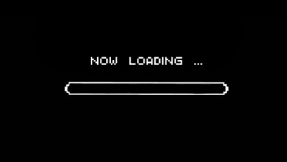
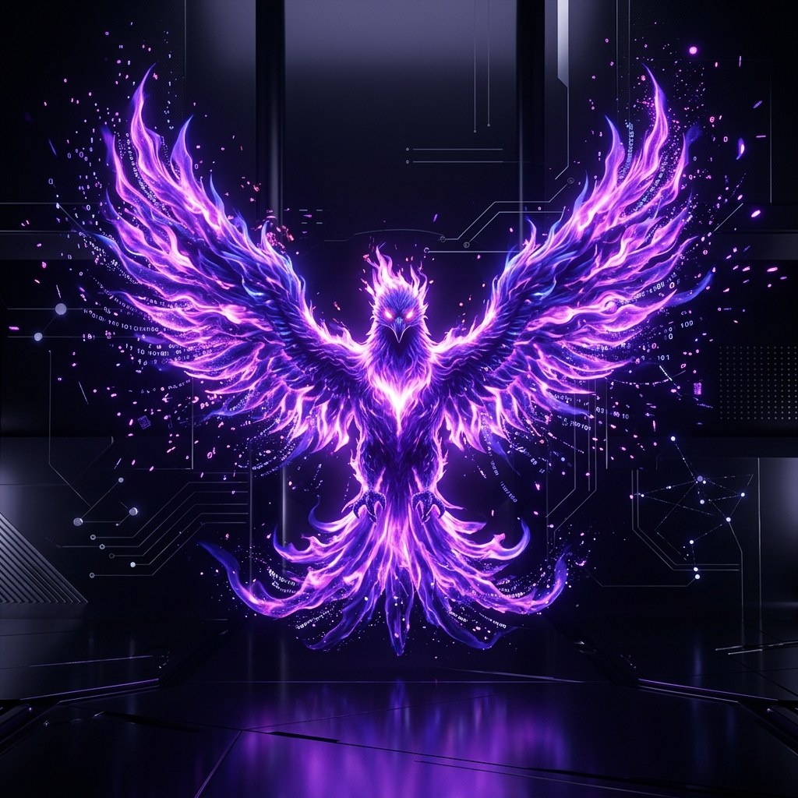

# 
🦅 OPERATOR: Ph0eNyx

  

  

  

  

  

---

## 
🔥 El Despertar del Defensor

  <i>"La defensa no es un estado, es un proceso constante de evolución. Como el fénix, de los restos de un incidente surge una infraestructura más fuerte."</i>

  

    Soy <b>Ph0eNyx</b>, Analista <b>Blue Team</b> y especialista en <b>Forense Digital (DFIR)</b>. Mi misión es transformar la vulnerabilidad en fortaleza y los ataques en inteligencia accionable. Con base en la disciplina y la visión técnica, fortifico activos críticos contra las amenazas más persistentes.
  

---

## 
🛠️ Arsenal de Guerra Digital

| 🔍 **Detección & SIEM** | 🕵️ **DFIR & Reversa** | 💻 **Dev & Ops** |
| :--- | :--- | :--- |
|  |  |  |
|  |  |  |
|  |  |  |

  

---

## 
🌐 Conectividad & Comunidad

  
  
  

 

  
  
<i>"Surgiendo de los datos, renaciendo en la defensa."</i>

