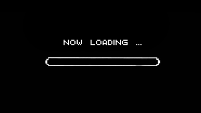

  <!-- Recuerda cambiar 'tu-usuario' por tu nombre real de GitHub en estas 3 URLs -->
  
  &nbsp;
  
  &nbsp;
  

 

<!-- SEPARADOR: ABOUT ME -->

  

 

  
  <h3>¡Hola! Soy Ph0eNyx</h3>
  Soy un Analista <b>Blue Team</b> y especialista en <b>Forense Digital (DFIR)</b>. Mi misión principal es transformar la vulnerabilidad en fortaleza y los ataques en inteligencia accionable. Con una base sólida en la disciplina y visión técnica, me dedico a fortificar activos críticos contra las amenazas persistentes del ciberespacio.

 

  
  <h3>Enfoque Principal (Blue Team Ops)</h3>
  &nbsp; Análisis de memoria, discos y recuperación de evidencias críticas.  
  &nbsp; Contención, erradicación y recuperación de sistemas comprometidos.  
  &nbsp; Búsqueda proactiva de adversarios ocultos en la infraestructura.

 

<!-- SEPARADOR: CONNECT -->

  

 

  
  &nbsp;
  
  &nbsp;
  

  

> La defensa no es un estado, es un proceso constante de evolución.

> Como el fénix, de los restos de un incidente surge una infraestructura más fuerte y preparada para el futuro.

  

<!-- SEPARADOR: CONTRIBUTIONS -->

  

 

  

  
  

  

<!-- SEPARADOR: ARSENAL -->

  

 

  <table align="center" style="background: transparent; border: none;">
    <tr>
      <td align="right" valign="middle" style="padding-right: 20px;">
        <strong>Sistemas & Entornos</strong>
      </td>
      <td align="left" valign="middle">
        
        
        
        
        
      </td>
    </tr>
    <tr>
      <td align="right" valign="middle" style="padding-right: 20px;">
        <strong>Forense & Seguridad</strong>
      </td>
      <td align="left" valign="middle">
        
        
        
        
        
      </td>
    </tr>
    <tr>
      <td align="right" valign="middle" style="padding-right: 20px;">
        <strong>Desarrollo & Datos</strong>
      </td>
      <td align="left" valign="middle">
        
        
        
        
        
      </td>
    </tr>
  </table>

